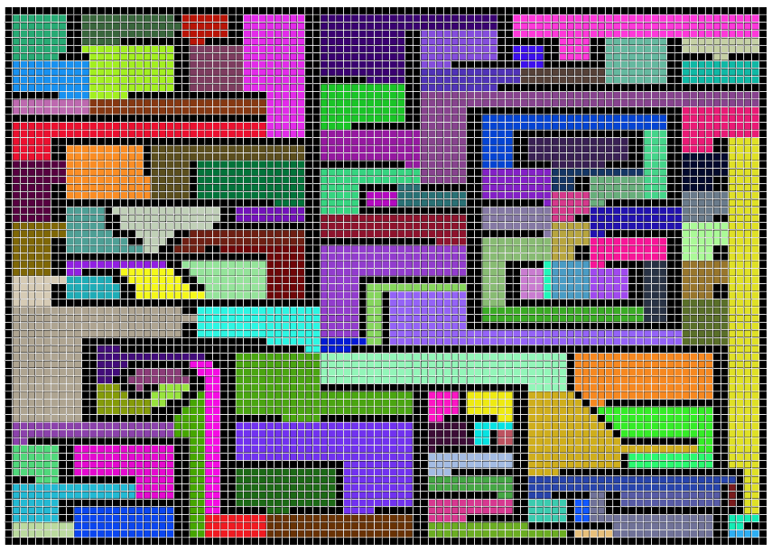

# Project IAJ
Pathfinding project for IAJ course @ IST

Warning: Unless you have a supercomputer, do not execute path 1 of the giant grid using Dead End with the unity debugger on. Your pc might crash.

When using Dead-End A*, you can use GridManager's DrawClusters to create an image like this one.

